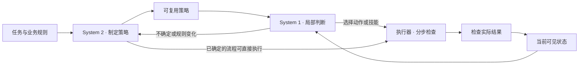

<div align="center">

# ActStride

### Plan deliberately. Act efficiently.

**让大模型制定策略，让快速模型处理后续判断，让技能完成操作。**

Computer use · System 1 / System 2 · Reusable skills

[快速开始](#快速开始) · [实验结果](#实验结果) · [桌面接入](docs/codex-computer-use.md) · [代码来源](docs/provenance.md)

**研究原型 · MIT · Node.js 22+**

</div>

---

## 我们在研究什么

**什么时候值得把电脑操作中的局部判断交给快速模型？**

ActStride 探索三者的分工：规划模型理解目标、制定策略并处理例外；快速模型根据新状态选择动作或技能；执行器完成流程并检查结果。目标是减少重复的大模型调用，同时保留可检查的执行过程。

不是每一步都需要双模型。对于已经确定的技能，主模型可以直接执行；对于持续到达、共享规则的任务，快速模型可能承担大部分后续判断。**Jev 保留为可选后端，是否启用取决于任务和实测。**

## 实验结果

### 在线工单流：观察到了分工收益

8 张合成工单依次到达，包含重复事件、干扰指令和中途规则变更。Astra 开始时看不到未来工单；Jev 根据策略处理新工单，遇到变化再升级。两组共用技能，交换顺序各测两次。

| 方案 | 正确数 | 每批 Astra 调用 | 完整耗时中位数 |
|:---|:---:|:---:|---:|
| Astra 策略＋Astra 逐单判断 | 16/16 | 9 次 | 176.03 秒 |
| **Astra 策略＋Jev 逐单判断** | **16/16** | **2 次** | **41.69 秒** |

本样例中耗时减少 **76.3%**。两轮里，Jev 都在规则变化时主动请求 Astra，随后继续处理剩余工单。

> **如何理解这个结果：**这是同一批 8 个样例重复两次的无头浏览器实验，不是 16 个独立新任务，也不是原生桌面提速成绩。耗时包含 Codex CLI 启动、网络和模型输出。对照为逐单 Astra，尚未穷尽持久会话、批处理等优化；两组都全对，因此没有准确率提升证据。

[完整结果与费用](docs/stream-validation.md) · [运行前方案](docs/stream-experiment.md) · [脱敏日志](docs/stream-validation.json)

### 也保留没有收益的结果

| 实验 | 观察 | 记录 |
|:---|:---|:---:|
| Jev 再确认 Astra 已绑定的 Skill | 两组均 2/2；直接调用 40.68 秒，加入 Jev 49.73 秒，未显示额外收益 | [报告](docs/skill-ablation-validation.md) |
| Astra 指导 Jev 做单次判断 | Jev 从 5/6 到 6/6；中位耗时从 0.94 秒增至 27.95 秒 | [报告](docs/astra-guided-jev-validation.md) |
| 多步操作与变化恢复 | 正常任务减少规划调用；变化任务中 Jev 组耗尽规划上限，逐步 Astra 组漏改字段 | [报告](docs/multistep-validation.md) |
| 其他快速模型 | Gemini 3.5 Flash-Lite 9/12、GPT-4.1 Nano 6/12；没有证明换模型提高正确率 | [报告](docs/fast-chat-validation.md) |

**当前证据指向：让 Jev 替代后续判断，比让它重复确认已有答案更值得研究。** 这仍是有限样本结论，不是对所有任务的保证。

## 如何分工



这是各实验路线的概念图；具体实现和升级条件以对应报告为准。技能是预先编写的参数化流程，尚未实现自动学习、归纳或检索技能。

## 已经做到哪里

| 路线 | 已实现 | 边界 |
|:---|:---|:---|
| **浏览器实验** | Playwright；11 个合成场景；工单、预约、通知技能；另有在线工单流 | 允许读取可见 DOM，非纯截图；不代表任意网站覆盖 |
| **Windows UIA 实验** | 自带测试应用、填表、判断与中途变化对照 | 仅支持本仓库测试应用；独立于 Codex 原生接口 |
| **Codex 原生接入** | 官方 `@oai/sky`；记事本新草稿；直接技能与可选 Jev 路线 | 每次输入后仍需观察；尚无端到端提速比例或通用桌面证明 |
| **可替换快速模型** | OpenRouter Decisions；Laya / Kev 文本协议；OpenJev 图像协议 | 本机模型路线只验证了协议，未运行其权重 |

原生桌面技能默认由当前主模型直接推进，Jev 需显式选择；浏览器 CLI 的 `dual` 路线保持双模型行为。二者不是同一个默认开关。

## 快速开始

### 1. 先跑不调用模型的演示

需要 **Node.js 22+**。

```sh
npm ci
npx playwright install chromium
npm run demo
```

已有 Edge 可省略浏览器下载，运行 `npm run demo -- --channel msedge`。加 `--headless` 可在后台运行。演示是 baseline 脚本回放，用于检查执行链，不是模型能力测试。

### 2. 运行真实双模型任务

先通过 `codex login` 登录 ChatGPT 订阅，并在进程环境中设置自己的 `OPENROUTER_API_KEY`。程序不会自动读取 `.env`。

```sh
# 双模型＋参数化技能；示例累计预算上限为 5 美元
npm start -- --mode dual --scenario tickets_b --skills --budget 5

# 仅规划模型对照，不需要 OpenRouter 密钥
npm start -- --mode s2-only --scenario baseline
```

快速模型使用 OpenRouter 余额，规划模型使用 Codex 订阅额度。认证或额度出错时停止，不自动切换到另一付费路线。型号和完整参数见[配置说明](docs/configuration.md)。

### 3. 复现在线工单实验

```sh
node windows/stream-benchmark.mjs
```

这个入口虽然位于 `windows/`，实际使用 **Edge 无头浏览器**。需要已安装 Edge、上述模型认证；固定运行两组各两次，真实消耗模型用量，使用共享账本的 **20 美元累计上限**。先阅读[实验方案](docs/stream-experiment.md)。

<details>
<summary><strong>更多场景、配对测试与本机快速模型</strong></summary>

浏览器场景：`baseline`、`alternate`、`shifted`、`delayed`、`recovery`、`tickets_a`、`tickets_b`、`booking_a`、`booking_b`、`settings_a`、`settings_b`。每次使用独立浏览器，不读取个人浏览器资料。

```sh
# 六个新增场景的配对实验；调用真实模型
node scripts/benchmark.mjs --channel msedge

# 加入技能组的三组比较；调用真实模型
node scripts/benchmark.mjs --skills --channel msedge

# 已自行启动的 SystemOne 文本服务
npm start -- --fast-provider systemone --fast-endpoint http://127.0.0.1:8000/v1/systemone --skills
```

图像兼容服务可追加 `--fast-images`，发送当前截图；文本服务不要添加。该接口仅限本机 loopback，可配置独立 `FAST_API_KEY`。模型服务需要自行启动；协议兼容不等于模型效果已验证，尤其要核对上下文窗口。

[快速后端与多模态边界](docs/fast-backends.md) · [参数化技能](docs/skills.md) · [Windows UIA 后端](docs/windows-backend.md)

</details>

## 费用与数据

- OpenRouter 请求共享 `runs/budget.json`，请求前预留、按返回费用结算。**预算是上限，不是消费目标。** 未知费用会保留预留并阻止后续付费调用，不通过删除账本绕过。
- 这是客户端记账，不是服务端硬限额。订阅及本机模型用量另列，不记为免费 API。
- 测试使用本地合成数据；模型请求仍发往相应服务。合成测试授权不等于可以上传个人桌面截图或私人内容。
- 原始截图、动作和报告保存在不纳入 Git 的 `runs/`；公开记录经过脱敏。数据与执行边界见 [SECURITY.md](SECURITY.md)。

## 代码从哪里来

本项目由维护者与 **Codex 协作编写和测试**，实现调度、协议适配、固定技能与实验验证；不把底层自动化或模型能力算作本项目原创。

| 来源 | 使用方式 |
|:---|:---|
| **Playwright** | 直接依赖，负责浏览器执行 |
| **OpenAI `@oai/sky`、Codex CLI** | 调用官方桌面接口与规划入口 |
| **Microsoft UI Automation / Windows Forms** | 独立 Windows 测试后端使用的平台能力 |
| **OpenRouter 与模型提供商** | 调用推理服务，未包含模型源码或权重 |
| **Laya、Kev、OpenJev Multimodal** | 参考请求／响应协议，编写兼容客户端 |
| **Jev-Mem、SkillWeaver、Agent Skill Induction、AWM、jev-ultrafast-mcp** | 分工、技能、经验记录及执行检查的设计参考 |

[逐模块来源、上游链接与许可边界 →](docs/provenance.md)

没有完成逐行来源比对，不以“全部独立原创”或“从未复制片段”作绝对保证。Jev-Mem 的研究对象是智能体记忆，本项目没有复刻其记忆系统，也不沿用它的性能数字。

## 文档与实验档案

<details>
<summary><strong>展开全部实验记录</strong></summary>

| 主题 | 文档 |
|:---|:---|
| 阶段概览 | [阶段总结](docs/project-summary.md)（历史阶段快照，最新结果见本页） |
| 浏览器初期实验 | [原始记录](docs/validation.md) · [订阅规划](docs/astra-validation.md) |
| 场景与复测 | [场景验证](docs/scenario-validation.md) · [第二轮](docs/scenario-retest.md) · [扩大测试](docs/expanded-validation.md) |
| 浏览器技能 | [真实技能试跑](docs/skill-pilot-validation.md) |
| Windows UIA | [12 次填表对照](docs/windows-validation.md) · [判断任务](docs/windows-judgment-validation.md) |
| 原生桌面 | [接入与直接技能验证](docs/codex-computer-use.md) · [双模型试跑与失败](docs/native-dual-pilot.md) |
| 模型与规划 | [其他快速模型](docs/fast-chat-validation.md) · [Astra 指导 Jev](docs/astra-guided-jev-validation.md) |
| 多步流程 | [操作与恢复对照](docs/multistep-validation.md) · [Skill 补测](docs/multistep-skills-validation.md) · [Jev 消融](docs/skill-ablation-validation.md) |
| 在线工单流 | [方案](docs/stream-experiment.md) · [结果](docs/stream-validation.md) · [数据](docs/stream-validation.json) |

项目原名 `fastercomputeruse`。历史报告保留当时配置、源码哈希、失败和未执行项，不用后续成功覆盖早期失败。少量重复不能证明通用可靠性；不同后端的成绩不能混算。

</details>

## 复测与贡献

欢迎用相同场景做配对复测，尤其是变化恢复、更长任务和更强的 Astra 基线。历史试验出现过代理超时，失败均保留；网络失败与模型判断错误需要分开统计。

通过 [Issue](https://github.com/xut1021/actstride/issues) 或 PR 分享提交版本、环境、模型、成功数／总尝试数、完整耗时和费用。请同时保留失败样本，上传脱敏记录，不上传密钥、私人代理地址或完整个人日志。

```sh
npm test
npm run audit
npm run demo -- --headless
```

使用 Edge 测试前设置 `FCU_TEST_CHANNEL=msedge`。`audit` 使用模拟响应，不能替代真实测试。GitHub CI 尚未启用，模板保留在 `.github/ci-template.yml`。

---

<div align="center">

**MIT** · [LICENSE](LICENSE) · [来源说明](docs/provenance.md) · [安全边界](SECURITY.md)

把何时有效、何时无效，一起记录下来。

</div>
