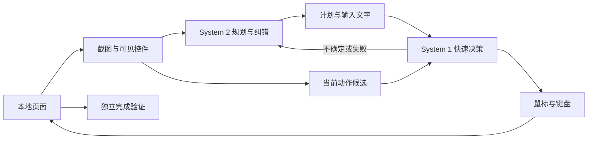

# fastercomputeruse

**让轻量模型处理高频操作，让推理模型负责规划与纠错。**

参考 [Jev-Mem](https://github.com/libingzheren/Jev-Mem)（System-One-Controlled Agentic Memory）将高频决策与深度推理解耦的思路，本项目把这种分工用于 **computer use 提速实验**：System 2 看截图和可见控件，给出计划；System 1 从当前页面生成的候选动作中选择下一步。遇到错误、低置信度或连续无进展，再交回 System 2。

Jev-Mem 研究的是智能体记忆，本项目是独立的浏览器实现，不复刻它的记忆系统，也不把它的实验数字当作 computer use 的提速证据。

目前支持仓库自带的十一种本地合成场景，覆盖物品搜索与填表、工单分派、会议室预约、通知设置，并包含布局变化、延迟加载和提交失败恢复。通过 Playwright 的鼠标和键盘操作，允许读取可见控件结构，因此属于 **DOM 辅助的浏览器 computer use**。通用桌面和任意网站尚未支持。

## 快速开始

需要 Node.js 22+。

```sh
npm ci
npx playwright install chromium
npm run demo
```

这是不调用模型的脚本回放，用来检查执行器与独立验证器。已安装 Edge 时可以跳过浏览器下载，运行 `npm run demo -- --channel msedge`。后台运行加 `--headless`。

## 真实模型运行

默认使用 OpenRouter 上的付费快速决策模型，以及通过官方 Codex CLI 登录的订阅规划模型。先设置进程环境变量 `OPENROUTER_API_KEY`，运行 `codex login`，确认登录方式为 ChatGPT。程序不会自动加载 .env 文件。

```sh
npm start -- --mode dual --budget 5
npm start -- --mode dual --scenario recovery --budget 5
npm start -- --mode s2-only --scenario baseline
```

双模型模式中，快速决策消耗 OpenRouter 余额，规划消耗 Codex 订阅额度；仅规划模型的对照模式无需 OpenRouter 密钥。启动时显示实际模型和计费路线。订阅认证或额度出错时直接停止，不自动切换到付费 API。具体型号、CLI 版本要求和其他配置见[配置说明](docs/configuration.md)。

原有场景：`baseline`、`alternate`、`shifted`、`delayed`、`recovery`。新增场景：`tickets_a`、`tickets_b`、`booking_a`、`booking_b`、`settings_a`、`settings_b`。脚本回放只支持 baseline。每次运行使用独立浏览器，不读取个人浏览器资料，页面不向外部提交信息。

执行六个新增用例的双模型与仅规划模型配对实验：`node scripts/benchmark.mjs --channel msedge`。共计划 12 次真实运行，交替模式顺序，每个组合最多 24 步。失败不自动重试；存在未结算费用时，余下付费组合标记为未执行。

所有真实运行共享 `runs/budget.json`。5 美元是累计上限，不是消费目标。请求前预留费用，按提供方返回的费用结算；未知费用或中断保留预留并阻止后续消费，不自动重试。此限制依赖提供方价格和用量信息，是客户端记账，不是服务端硬限额。不要删除账本绕过限制。

## 工作流程



- 候选动作来自当前可见控件，不使用测试答案或预写的解题选择器。
- 进度判断检查控件、焦点、输入值和可见错误，避免把装饰性的像素变化算作成功。加载状态提供短暂等待动作。
- 出现新的页面错误立即请求重新规划；连续两次无进展也会交回规划模型。低置信度阈值 0.55 尚未经过校准。
- 完成只能由独立验证器确认，模型说“完成”不算成功；后续修改表单会清除旧 PASS。
- 隐藏答案和验证状态不进入模型输入。页面展示任务要求，属于透明的集成实验，而非盲测。

## 验证与边界

新的多任务配对结果见[扩大测试](docs/expanded-validation.md)。原有页面结果见[场景验证](docs/scenario-validation.md)和[第二轮复测](docs/scenario-retest.md)。早期单页面实验见[原始记录](docs/validation.md)和[订阅规划记录](docs/astra-validation.md)；历史记录保留当时使用的配置与所有尝试。

单次和少量重复不能证明普遍提速或通用可靠性。两种模式必须在相同场景下比较，且订阅规划调用的启动开销计入耗时。新增日志分别记录初始化、浏览器、观察、执行和模型调用耗时；CLI 事件时间包含通信与推理，不能当作纯推理耗时。

本地 `runs/` 保存截图、动作、费用和报告，不纳入 Git。报告的 `cost_usd` 仅统计 OpenRouter 费用，不把订阅用量标为免费。当前场景限制外部浏览器请求和 WebSocket，但并非操作系统安全沙箱；模型请求仍会发往对应服务。

## 希望得到网络环境更稳定的朋友帮助复测

我目前的网络环境会偶发代理连接超时，影响真实模型测试。第二轮五场景测试完成了 4/5，布局变化场景在请求 Jev 时遇到 `fetch failed`；对应时刻的本机代理日志显示，连接上游代理节点发生 `i/o timeout`。上一轮提交恢复场景也遇到过相同问题。这些失败都保留在测试记录中，不能据此判断模型不具备相应操作能力，也不能把未完成的运行算作通过。

**希望有更稳定网络环境、能够可靠访问模型服务的朋友，帮我复测这些场景，尤其是布局变化与失败恢复。** 按上面的配置说明准备好自己的模型访问权限后，可以运行：

```sh
npm start -- --mode dual --scenario shifted --headless --budget 5
npm start -- --mode dual --scenario recovery --headless --budget 5
```

使用已安装的 Edge 时追加 `--channel msedge`。真实运行会消耗你自己的 API 余额和订阅额度，请按自己的预算执行；不要为追求通过而反复重试未结算的请求。

欢迎通过 [Issue](https://github.com/xut1021/fastercomputeruse/issues) 或 PR 分享结果：注明提交版本、运行命令、系统与 Node 版本、模型配置、是否使用代理，以及成功次数/总尝试次数、耗时和费用。请同时保留失败结果，附上脱敏的 `report.json` 和相关错误信息；不要上传密钥、完整原始日志或私人代理地址。如果条件允许，也欢迎在同一场景下比较 `dual` 与 `s2-only`，帮助检验速度收益是否稳定。

## 本地检查

```sh
npm test
npm run audit
npm run demo -- --headless
```

使用 Edge 测试前设置 `FCU_TEST_CHANNEL=msedge`。测试覆盖动作路由、预算、认证隔离、完成状态失效和各场景验证器。审计使用模拟模型响应，不能代替真实模型测试。GitHub CI 尚未启用：发布凭据缺少 workflow 权限，模板保留在 `.github/ci-template.yml`。数据边界见 [SECURITY.md](SECURITY.md)。

## 参考与许可

- [Jev-Mem](https://github.com/libingzheren/Jev-Mem)：System 1 / System 2 分工的参考来源。
- [OpenRouter Jev 使用说明](https://openrouter.ai/blog/tutorials/how-to-use-jev/)
- [OpenRouter Decisions API](https://openrouter.ai/docs/api/api-reference/alphadecisions/submit-a-decisions-request)

MIT，见 [LICENSE](LICENSE)。研究原型。
