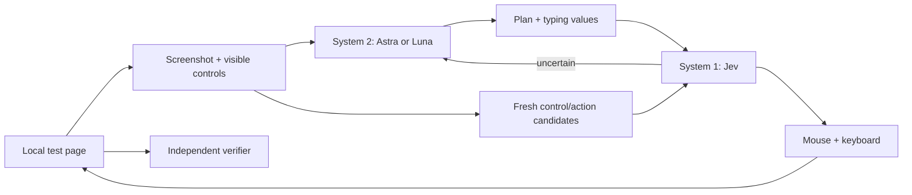

# fastercomputeruse

**Jev chooses the next action. Astra or Luna plans and repairs. A browser executes.**

An experimental two-model browser agent using OpenRouter. System 2 receives a screenshot plus visible control structure and supplies a plan and typing values. System 1 receives the control structure and selects one freshly generated action candidate. Low confidence or repeated lack of progress sends control back to System 2.

Two planner routes are available: **GPT-6 Astra through a ChatGPT-authenticated Codex CLI**, or GPT-6 Luna through OpenRouter. The Astra route uses your Codex subscription allowance; Jev still uses paid OpenRouter credits. No subscription credentials are copied or converted into API keys.

This release runs **one synthetic local webpage**, including search, stock filtering, a form and a confirmation dialog. Actions use Playwright mouse and keyboard events. This is browser computer use with DOM assistance, not a pure screenshot agent or a general Windows desktop agent. The name describes the experiment's goal; performance depends on the task and providers.

## Run without an API key

Requires Node.js 22+.

```sh
npm ci
npx playwright install chromium
npm run demo
```

The demo is a **scripted replay**, not an AI evaluation. It tests the browser executor and independent completion check. Add `-- --headless` for an unattended run. On a machine with Microsoft Edge installed, skip the Chromium download and use `npm run demo -- --channel msedge`.

## Run the real models

Set `OPENROUTER_API_KEY` in the process environment using your preferred secret manager. `.env` files are not automatically loaded. Do not paste keys into issues, command arguments, or source code.

### Jev + Astra using your Codex plan

Install the official Codex CLI if needed, run `codex login`, and verify that `codex login status` says **Logged in using ChatGPT**. This integration was tested with CLI 0.156.1. It requires that version's `--ignore-user-config`, image input and structured-output support. Older unsupported CLIs fail instead of silently changing the billing route.

```sh
npm start -- --planner-provider codex --mode dual --budget 5
npm start -- --planner-provider codex --mode s2-only
```

The first command pays only for Jev on OpenRouter and uses `gpt-6-astra` with medium reasoning via Codex for planning. The second uses Astra for every step and needs no OpenRouter key. Add `--headless --channel msedge` for unattended Edge. The CLI creates one ephemeral, read-only Codex invocation for each planner decision and receives a screenshot plus structured state. Shell tools, apps, hooks and delegation are disabled for that invocation; an unexpected tool event rejects the result. Launch overhead is included in timings.

API-key authentication is rejected. API-key environment variables are removed from the Codex child process, personal configuration is not loaded, and there is no fallback to a paid OpenAI/OpenRouter planner. If authentication, quota or the CLI fails, the run stops. Logs record Codex tokens separately: `cost_usd` covers **OpenRouter only**, not a dollar estimate of subscription usage. Account-wide weekly usage also includes your other Codex work.

See the [Astra validation record](docs/astra-validation.md). The [official authentication documentation](https://learn.chatgpt.com/docs/auth) explains the ChatGPT/API billing distinction, and the [non-interactive guide](https://learn.chatgpt.com/docs/non-interactive-mode) documents structured outputs.

### Jev + Luna using OpenRouter only

```sh
npm start -- --mode dual --budget 5
npm start -- --mode s2-only --budget 5
```

For headless Edge: append `--headless --channel msedge`. Both modes use a fresh isolated browser, the same task, action executor, observation data and verifier. `dual` uses `typesafe/jev-1.13` through OpenRouter's **Decisions API**, plus `openai/gpt-6-luna` through Chat Completions. `s2-only` calls Luna for every step. There is no third model. Model IDs must be available to your OpenRouter account; the program fails if current metadata cannot be verified.

Live runs share a persistent `runs/budget.json` spending limit. **Five dollars is a ceiling, not a target.** The controller reserves a conservative whole-context cost before each request, accounts for reported `usage.cost`, runs one request at a time and performs no automatic retries. Chat requests also set provider price ceilings. The Decisions endpoint uses current endpoint metadata for its reservation; it has no verified per-request price ceiling here. This is client-side accounting dependent on provider metadata and billing, not a provider-enforced dollar cap. Use a separately limited OpenRouter key if you need an account-side limit.

Missing billing, HTTP errors or interrupted requests retain the reservation and block subsequent spending. Reconcile the charge in OpenRouter before adjusting an unsettled ledger. Do not delete the ledger to bypass its limit. Do not run separate copies against a shared spending allowance: the lock and ledger apply to this checkout only.

## How it works



- `browser.mjs` gathers visible controls and screenshots; execution never evaluates model-generated JavaScript.
- `candidates.mjs` builds actions from current controls and Luna's text values. It contains no task answers or selector-based solution.
- `controller.mjs` routes requests and validates actions. A Jev confidence below 0.55 escalates; that threshold is an uncalibrated heuristic. Two no-progress observations also request replanning. `codex-planner.mjs` implements the optional subscription planner route.
- `budget.mjs` keeps the spending ledger across runs.
- `index.html` owns the synthetic task and verifier. Only the independent verifier can mark a run successful; a model saying `done` is insufficient.
- `replay.mjs` is the separate deterministic fixture. Only replay/tests use task-specific selectors to solve the form.

For Jev, inputs include task, plan, recent actions, visible page text, controls and their values. Luna additionally receives the viewport screenshot. The hidden `window.labResult` verifier state is never included in model input. The page intentionally displays its task and completion criteria, so this is a transparent integration exercise, not a blind reasoning benchmark.

## Evidence and limits

In the initial three runs per mode, both completed 3/3 tasks. Jev + Luna averaged **20.3 seconds and $0.00158** per run; Luna alone averaged **68.7 seconds and $0.00626**. These are exploratory measurements on the single bundled page, with uncontrolled machine load and an unoptimized baseline. They do not establish general speed or reliability.

See [validation results](docs/validation.md) for real paid runs, costs and comparison with Luna alone. All attempts in that evaluation are retained, including failures. Local `runs/` contains screenshots, decisions, billed usage and a report for each run, and is excluded from Git.

One fixed page cannot establish general computer-use ability, reliability across websites, or a general speed advantage. The browser only serves the bundled page and blocks other network requests and WebSockets. It uses no personal browser profile. There is no arbitrary-site flag, shell tool, file upload or external purchase workflow. Browser request blocking is a test restriction, not an operating-system security sandbox. The Node process still contacts OpenRouter for metadata and inference.

## Tests

```sh
npm test
npm run audit
npm run demo -- --headless
```

If testing against installed Edge, set `FCU_TEST_CHANNEL=msedge` in the environment first. Tests cover routing, low-confidence escalation, stale choices, input validation, budget persistence, unknown billing, subscription billing isolation and real-browser completion invalidation. The additional audit exercises 33 deterministic fault/state checks and writes `runs/audit/report.json`. Its model transports are mocked and live fetch calls are prohibited; it is not a model benchmark. Run it separately from live inference so its ledger-unchanged check is meaningful. The CI template does not spend API credits. GitHub CI is not enabled in this release because the publishing token lacks workflow permission. The template is saved at `.github/ci-template.yml`; after authorizing workflow writes, move it to `.github/workflows/test.yml` to enable it. See [SECURITY.md](SECURITY.md) for the intended data boundary.

## 中文说明

这是一个可以真实运行的 **Jev 快决策 + Astra / Luna 规划与纠错** 实验。Jev 从当前网页控件生成的候选动作中选择，规划模型看截图和控件结构，提供计划及需要输入的文字。执行层负责鼠标、键盘，独立验证器判定是否完成。

使用 `--planner-provider codex` 时，Astra 走已登录 ChatGPT 的官方 Codex CLI，使用订阅额度；Jev 仍通过 OpenRouter 付费。不会把周额度当成 OpenRouter 余额，也不会把订阅用量标成“模型免费”。失败时停止，不自动切回付费大模型。验证器现在会在表单、选项或确认状态变化后清除旧 PASS。

当前只支持仓库自带的合成网页，并非通用桌面助手。允许读取控件结构，因此不是纯截图方案。`npm run demo` 是无费用脚本回放；`npm start` 才会真正调用模型。对照实验、成功次数、耗时与实际费用见[验证记录](docs/validation.md)。5 美元是多轮共享的上限，不会为了消耗额度而增加调用。

## References and license

- [OpenRouter: using Jev](https://openrouter.ai/blog/tutorials/how-to-use-jev/)
- [OpenRouter Decisions API](https://openrouter.ai/docs/api/api-reference/alphadecisions/submit-a-decisions-request)
- [JevPilot Reflex](https://github.com/manhua-man/jev-pilot-reflex), a driving simulation discussed during this project's exploration; this browser implementation is independent and does not claim affiliation.

MIT; see [LICENSE](LICENSE). Experimental research prototype.
