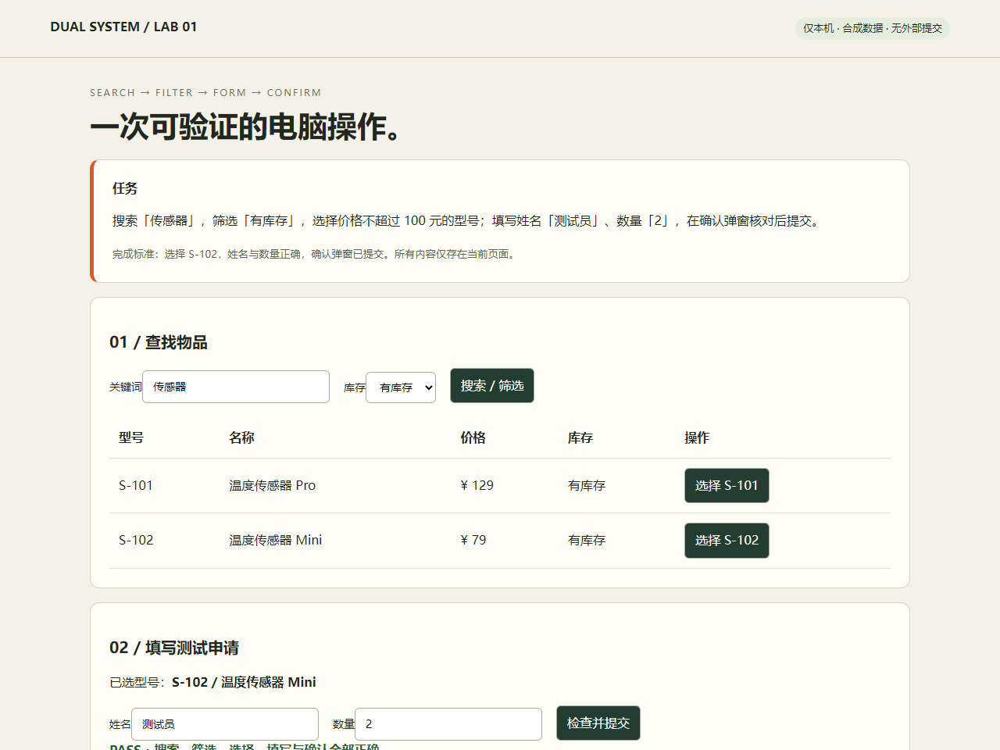

# Validation record

Evaluated September 26, 2026 (Asia/Shanghai). This is a six-run integration comparison on one fixed synthetic task, **not a general computer-use benchmark**.

## Real paid API runs

| Run (UTC start / mode) | Result | Wall seconds | API seconds | Decisions | Jev/Luna calls | Reported cost |
| --- | --- | ---: | ---: | ---: | ---: | ---: |
| 2026-09-25T17-37-01.684Z-dual | PASS | 25.175 | 15.241 | 14 | 12/2 | $0.001944 |
| 2026-09-25T17-38-08.031Z-s2-only | PASS | 71.922 | 67.005 | 15 | 0/15 | $0.006494 |
| 2026-09-25T17-39-20.182Z-dual | PASS | 17.364 | 12.881 | 14 | 12/2 | $0.001565 |
| 2026-09-25T17-39-37.772Z-s2-only | PASS | 69.328 | 63.310 | 15 | 0/15 | $0.006447 |
| 2026-09-25T17-40-47.323Z-dual | PASS | 18.395 | 12.776 | 13 | 12/1 | $0.001233 |
| 2026-09-25T17-41-05.950Z-s2-only | PASS | 64.914 | 59.401 | 14 | 0/14 | $0.005840 |

| Mode | Successes | Mean wall seconds | Mean API seconds | Mean cost |
| --- | ---: | ---: | ---: | ---: |
| Jev + Luna | 3/3 | 20.311 | 13.633 | $0.001581 |
| Luna only | 3/3 | 68.721 | 63.239 | $0.006260 |

Across these runs, the dual mode's mean wall time was 3.38 times lower and its mean reported API cost was 74.7% lower. These are descriptive ratios, not estimates of general performance. Total billed usage reported by the six runs: **$0.02352235**, within the shared $5 limit. No retry or hidden failed AI trial was removed from this set.

## Method and limitations

- Models: 'typesafe/jev-1.13' via Decisions and 'openai/gpt-6-luna' via Chat Completions. No explicit reasoning-effort or temperature override; provider defaults apply. Luna has a 2,048-token output cap.
- Windows, Node v24.18.0, Playwright 1.63.0, headless Edge 153.0.4234.48, fresh 1280×960 context per run. Alternating dual / single sequence, same HTML, task, screenshot and UI extraction, action validation and independent verifier. The first dual run also served as the initial smoke test.
- Wall time includes metadata requests, browser startup/closure, screenshots and 120 ms action settling. API time is the sum of local elapsed request measurements. Both include network variability; this is not provider-side inference latency.
- Local development and browser tests overlapped parts of the evaluation; machine load was not controlled. There are only three runs per mode, with no statistical confidence interval, randomized order or provider-cache control.
- Both modes receive visible control structure. Jev receives candidate actions and no images; Luna receives screenshots plus structure. The comparison is of these two complete controller configurations, not isolated model speed. The simple single-model prompt is not an optimized baseline.
- The visible page includes the expected SKU and task criteria. There are no unseen layouts or hidden challenges. This demonstrates orchestration and execution, not general reasoning or desktop capability.
- Some Luna-only runs repeated focus clicks. The no-visible-change feedback is a heuristic and can misclassify a useful focus action. These steps remain included in timings and costs.
- Decision counts include no-op escalations. Success comes from the page verifier checking the actual search/filter, selected SKU, name, quantity and confirmation; model self-reports do not count.
- Costs come from OpenRouter 'usage.cost' responses, not estimates. Metadata-based reservations were settled after each request; the ledger had no pending charge after completion. Client-side accounting is not a provider-enforced guarantee.

## Reproducibility and non-AI validation

'docs/validation.json' contains all six reports, sanitized per-step decisions and usage, and SHA-256 hashes of the evaluated runtime sources. Provider generation IDs were omitted; no credentials or local machine paths are included. Full screenshots remain in ignored local 'runs/' directories. A screenshot from the first successful dual run is shown below.

Ten automated tests passed locally using Edge: controller routing, low-confidence escalation and stale-choice rejection, candidate generation, single-model routing, invalid input rejection, persistent budget enforcement, uncertain billing, and real-browser execution including a negative verifier case. The scripted replay uses selectors to produce coordinates and is explicitly **not** an AI result. GitHub CI is unrun: the publishing credential lacks workflow scope. A disabled template at .github/ci-template.yml repeats tests and replay without an API key when enabled.

